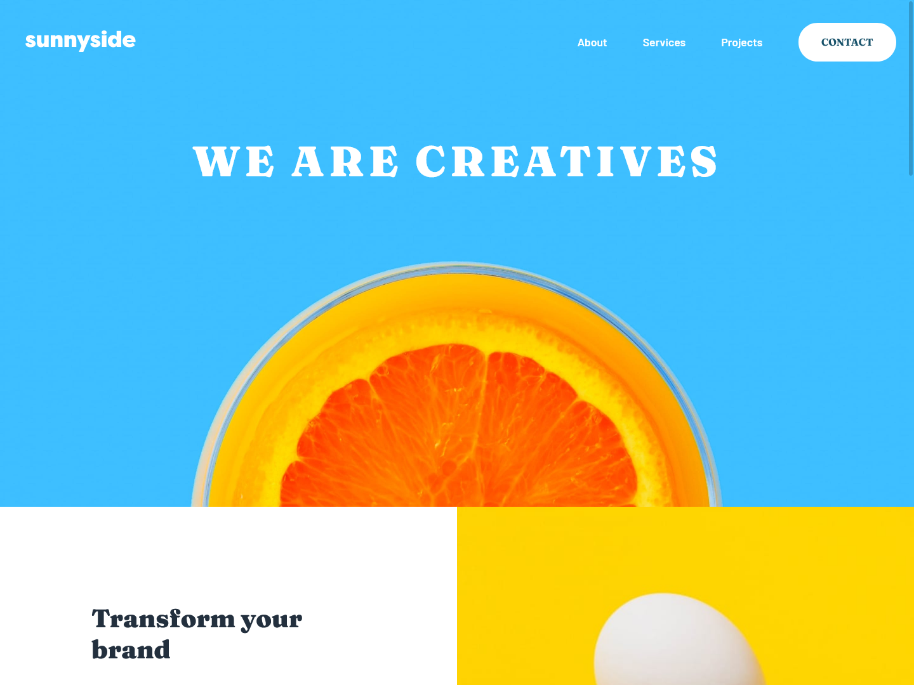
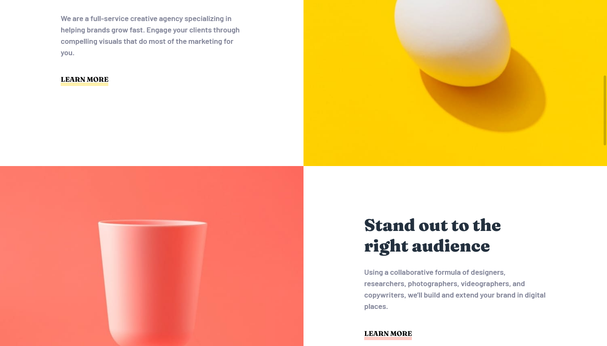
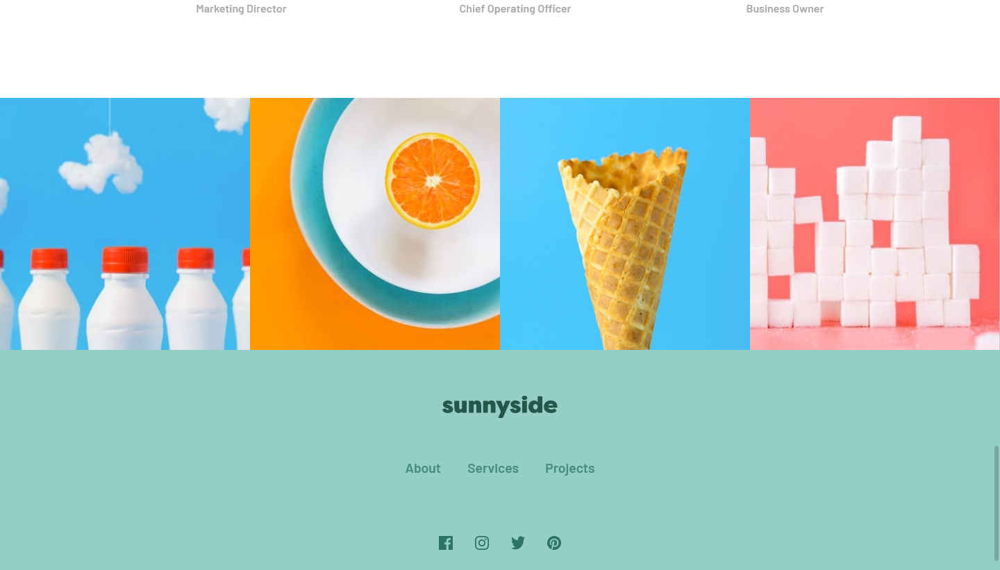

# Frontend Mentor - Sunnyside agency landing page solution

This is a solution to the [Sunnyside agency landing page challenge on Frontend Mentor](https://www.frontendmentor.io/challenges/sunnyside-agency-landing-page-7yVs3B6ef). Frontend Mentor challenges help you improve your coding skills by building realistic projects.

## Table of contents

- [Overview](#overview)
  - [The challenge](#the-challenge)
  - [Screenshot](#screenshot)
- [My process](#my-process)
  - [Built with](#built-with)
  - [What I learned](#what-i-learned)
  - [Continued development](#continued-development)
  - [Useful resources](#useful-resources)
- [Author](#author)

## Overview

### The challenge

Users should be able to:

- View the optimal layout for the site depending on their device's screen size
- See hover states for all interactive elements on the page

### Screenshot

## My process

### Built with

- Semantic HTML5 markup
- CSS custom properties
- Flexbox
- CSS Grid
- Mobile-first workflow

### What I learned

I learned a lot about css grids, and I got the chance to make some pretty huge mistakes in my html markup and css design, allowing me to better understand how I should markup my html and use my css for the next project. (Like using vh and vw for margins I realised that if you make it too long the thing is a mess but.. I'll fix it for the next project and not repeat the mistake)

### Continued development

Obviously I'd like to improve on using images as background and keeping a ratio that isn't horrible.
Moreover, I now know not to use vh and vw in places they shouldn't be used
I'm pretty happy about the way I got my flexboxes going though, I did some practice before this project and I felt it while using flexboxes so yay

### Useful resources

- [FlexBox Zombies](https://mastery.games/flexboxzombies/) - A great interactive way to master flexboxes, kinda got addicted to this type of learning because of it

## Author

- Frontend Mentor - [@Dardou](https://www.frontendmentor.io/profile/Dardou)

